slug: intercooler-hose-repair
title: Fixing an intercooler/turbo hose leak in a 2011 Mistubishi Triton (MN)
author: Jonathon Waterhouse
summary: 
created_at: 2021-05-05

A few months ago one of the intercooler hoses on my ute split. I'll describe here how I patched the split hose to (temporarily) get back on the road until a new set of hoses arrived, and how I replaced them.

## Symptoms of a split intercooler hose

Depending on the nature and location of the split, you might notice one of:

* whistling sound - as the high pressure air escapes from the leak. May also sound like a grinding/scraping noise.
* excessive black exhaust smoke - the leak causes a higher fuel to air ratio to be mixed in the engine, and causes more fuel to be burned and expelled out the exhaust.
* loss of power - another byproduct of an off fuel/air ratio, the performance gain usually given by a working turbo is lost and the car can feel sluggish and heavy.

In my case I had all three.

## Finding the leak

Fortunately for me, it was easy to find the leak - a split right on top of the hose connected to the engine air intake.

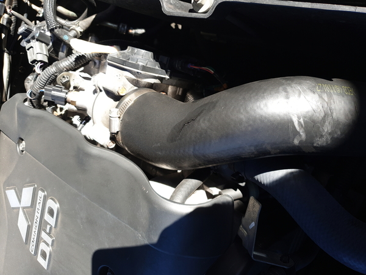

If not immediately visible, you'll need to poke around and under the hoses to find less obvious leaks. Leaks can also occur due to poor or loose connections so be sure the check the hose connections and clamps. Finally, leaks may also occur in the intercooler itself.

## Patching the leak

Though you can still drive with a (small) leak, a temporary patch will make driving more bearable until a permanent fix can be done. After reading a few other's experiences around the internet I decided to try the silicon tape method.

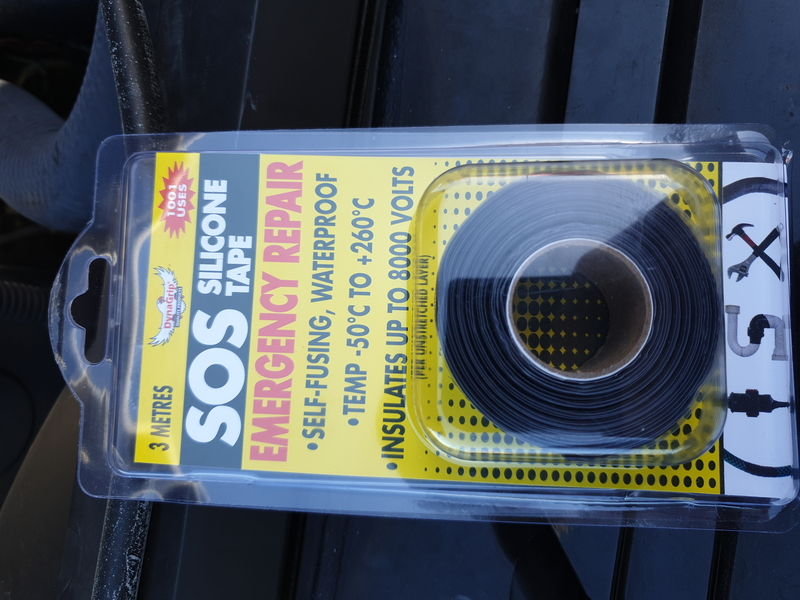

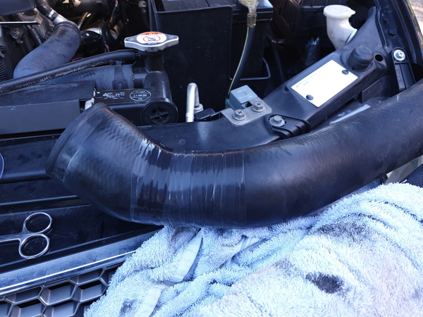

Silicon tape is self adhesive and quite strong, but is still no match for the high pressure put out by the turbo. It split almost immediately after a slight tap on the accelerator.

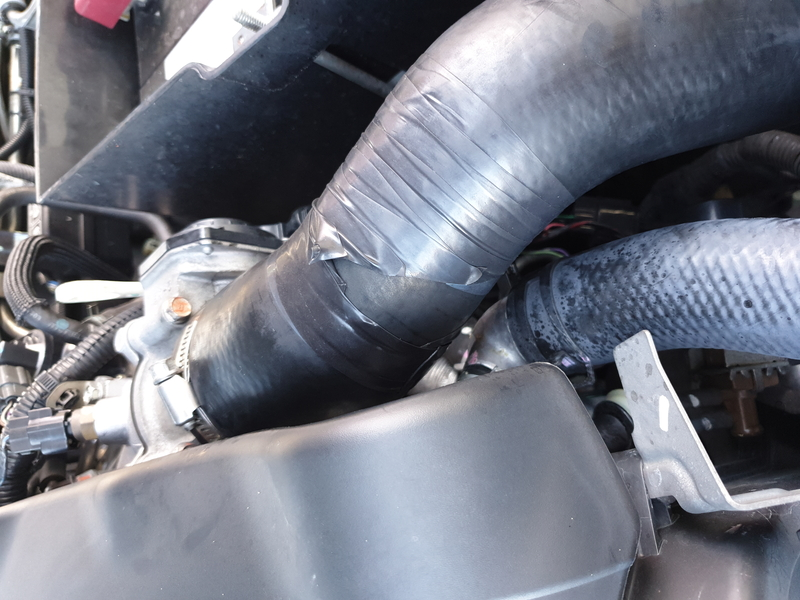

A more robust method is to use a combination of silicon tape, heavy duty duct tape and jubilee clips to resist the pressure.

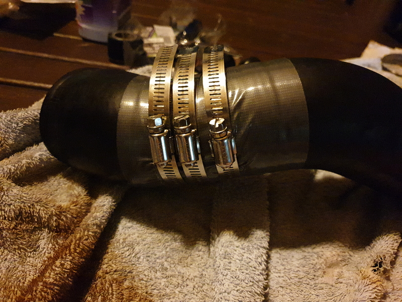

Apply the silion tape first by wrapping it tightly around the hose starting and ending about an inch either side of the split and overlapping about half the width of the tape. Next, do the same with some heavy duty duct tape starting and ending another inch either side of the silicon tape. And finally place a few jubilee clips around the length of the split. Tighten them firmly but not too tightly that they cause the hose to deform.

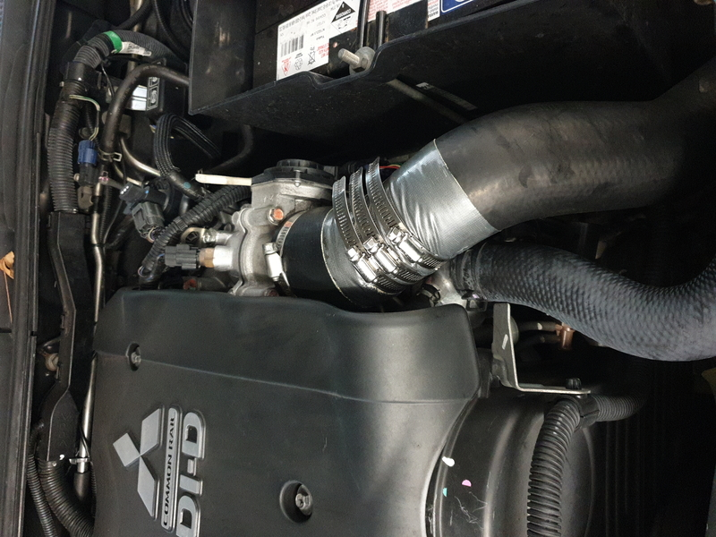

This patched hose lasted me about 4 weeks until I could order a new set of hoses and get them installed.

## Installing new hoses

I decided to replace all the intercooler hoses with new ones as I thought if one had split, the others are probably not far behind. The original hoses are rubber and I could feel the outer wall of them starting to rub off and disintegrate. I ordered a set of silicon hoses because a) silicon will hopefully last longer than rubber and b) an aftermarket set of silicon hoses is about 50% cheaper than OEM rubber hoses.

There are three hoses to replace. One coming out the left side of the engine that connects to the intercooler behind the front grille, one coming out of the intercooler and connecting to a plastic joiner, and the last from the joiner up the air intake on the right side of the engine.

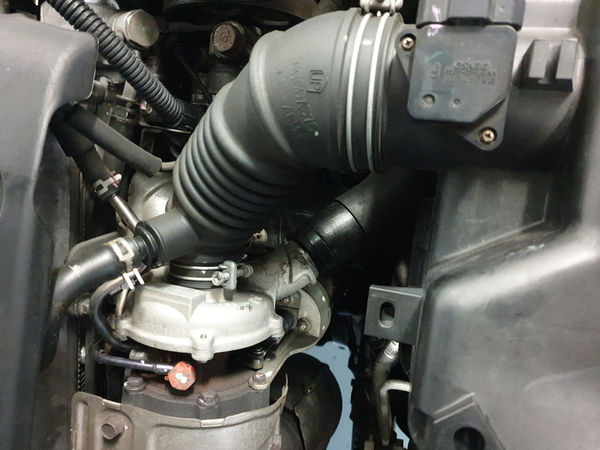
*Left side hose coming out the left side of the engine.*

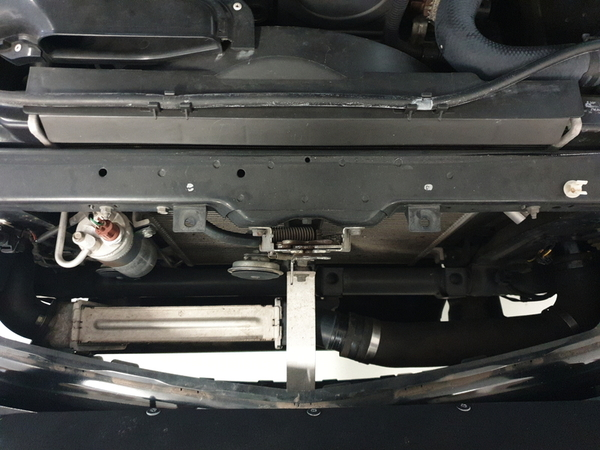
*Front hose connected to intercooler, top view.*

Installing the new hoses is pretty straight forward. The front grille can be removed after removing the plastic push clips that hold it, and each hose is held on with easily accessible jubilee clips. Simply remove the clips, slide off the old hoses, slide the new ones on and clip them in again.

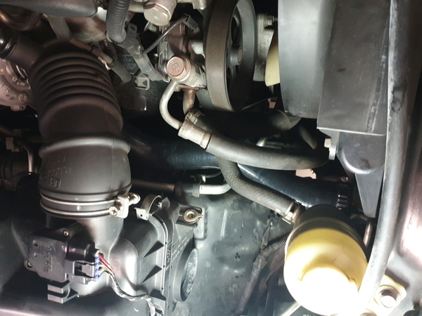
*Left side silicon hose installed.*

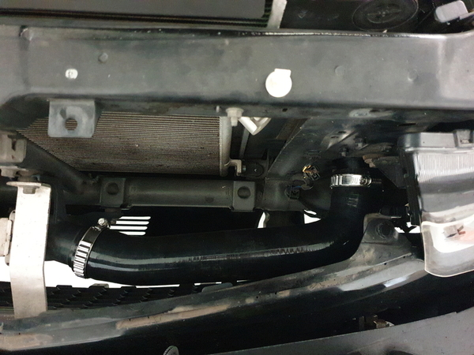
*Front silicon hose installed.*

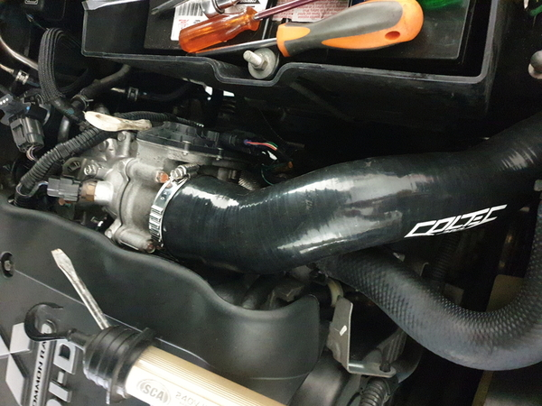
*Right side silicon hose installed.*

It's been several months now with the new hoses and the car is running well.
