slug: miele-refrigerator-repair-leak
title: Repairing a leak in my Miele K14827 refrigerator
author: Jonathon Waterhouse
summary: 
created_at: 2020-11-17

I've recently bought a second-hand fridge that needed some repairs. Usually, unless the fix is very simple, fridges that break down are deemed "uneconomical" to repair and sent to landfill. I hate that. So, I resolved to fix it as best I could and thought I would outline what I went through to (ultimately, successfully!) fix my fridge and hope it might help others keep theirs going a little while longer too.

_Note:_ please be aware I am *not* a licensed HVAC repair person (at one point I, embarrassingly, lit the fridge on fire)! If you're not confident in messing around with some of this stuff there's no shame in writing it off and picking up a new one.

## Background

I actually got two fridges, as a pigeon pair (basically two separate fridges that can be arranged side by side to look like one giant fridge). I got them off Gumtree (Australian craigslist), and the ad said both the fridges were working, though one was bit noisy.

The fridge models are Miele K14827 SD and K14827 SDE (one is all fridge, the other is half fridge/half freezer). Miele are a German company and premium kitchen appliance brand, and are generally renowned for making products of very high quality. They mostly make all their own stuff, however their refrigerators are actually made by another German company called Liebherr (who also sell fridges under their own brand name). Miele- and Liebherr-brand fridges are basically the same with only minor cosmetic difference between them.

## The problem

The fridge worked fine, but the fridge/freezer wouldn't stay cool. After leaving it running for a couple of days, the freezer section would get to the correct temperature (-18 deg celsius), but the fridge section would still be at room temperature. The compressor was running constantly, hot to the touch and quite noisy.

I took off the back cover inside the freezer to show the evaporator, and could see there was some frost on one of the copper lines, but none on the evaporator itself.

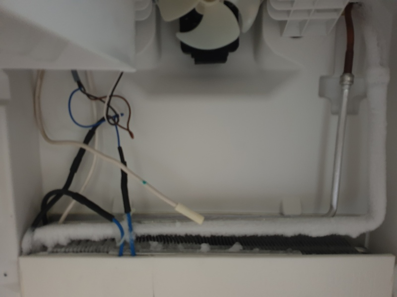

## Online research

Probably the most useful resource I found were the Help And Support forums at [UK whitegoods](https://www.ukwhitegoods.co.uk/forums/). I made a [post](https://www.ukwhitegoods.co.uk/forums/forum/public-support-forums/help-and-support/fridge-and-freezer-forum/864248-miele-kfn-14827-fridge-freezer-suspected-faulty-evaporator-sensor) about my problem and even though it ultimately didn't arrive at a fix, the community were still very helpful. I'd also suggest searching through past posts, it's likely a similar question has already been posted and answered by the quite active community.

Miele are apparently very secretive about their service manuals, and I couldn't find any online. I did however find some Liebherr fridge service manuals for similar models ([manual1](liebherr_KB4310_service_manual.pdf), [manual2](liebherr_CS_service_manual.pdf)). These contained useful disassembly instructions and technical specifications for the temperature sensors.

This [wiki page](http://wiki.diyfaq.org.uk/index.php/Refrigeration_Regassing_(R600a)) about how to regas/recharge a R600a fridge also ended up being quite helpful, as was this [reddit thread](https://www.reddit.com/r/HVAC/comments/bnt02j/r600a_refrigerant_my_first_exposure/).

## Finding the problem

Though my problem ended up being a refrigerant leak through a hole in the copper piping, I checked a few other things first that could be playing up. These are much simpler to check and generally cheaper/easier to repair, so are worth checking first.

### 1. Common problems

Quick things to check that could cause your fridge to run poorly:
- Ice build up around evaporator. Excessive ice or frost can inhibit airflow and can sometimes block the air circulation fan inside the fridge. Thoroughly defrost the fridge over a couple of days if this is the case.
- Door seals are leaking, causing loss of temp. You might see some moisture on the floor or dripping from where the broken seal is.
- Dust/lint build up on condenser coil. The compressor coil is a like a large heat-sink, if it's clogged up with excessive dust it won't be operating properly. Gently give it a clean, taking care not to puncture the piping.

### 2. Temperature sensors

Most fridges these days have a central computer that controls functions like when to run the compressor, when to run the defrost process, or when to switch cooling between the fridge and freezer. Though the circuit board can fail, as I understand it that would be very rare. What do sometimes fail though are the temperature sensors (or thermistors) that let the central computer "know" the temperature in various parts of the fridge. These are just simple resistors that vary with the temperature around them.

My particular fridge has four of them - two in the fridge compartment (one to read the evaporator temperature, and one for the main compartment) and the same in the freezer. Helpfully, the manual specifies what resistance they should read at various temperatures and that they should read 4.7 kOhms at room temp (25 deg celsius). The easiest way to test them is to get a multimeter on the connectors where they attach to the computer circuit board. This is located at the back next to the compressor.

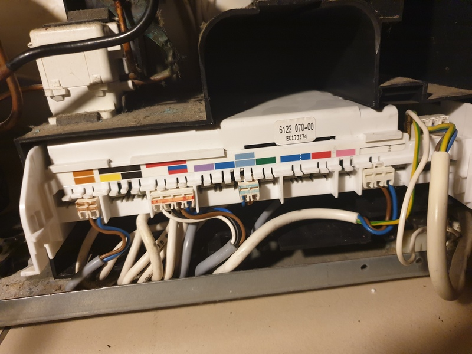
*Circuit board with the cover panel removed*

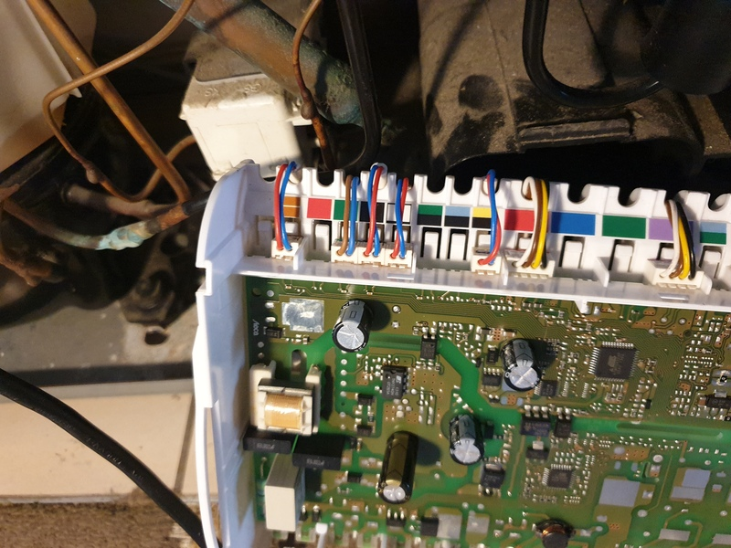
*Connectors on the left side of the board with red+blue wires are temperature resistors*

After removing the white plastic cover and sliding out the circuit board I could access the connectors for each of the thermistors (each are connectors with only two wires, red and blue on the left side of the circuit board). With the fridge off, they each read ~4.7 kOhms so I was confident they weren't a problem. You could also try put them in iced water to see if they change resistance appropriately. If you do have a dud thermistor, order a new one of the same spec and splice it in where the old one was. From reading about it online, it seems that evaporator sensors tend to fail more often than the compartment ones.

### 3. Compressor checks

Compressors are pretty sturdy bits of equipment, but can sometimes fail. An easy way to check if it's okay is to test the three terminals that come out of the compressor (see [here](https://yorkcentraltechtalk.wordpress.com/2011/07/05/compressor-electrical-diagnostics/) for a good overview).

I've got an Embraco VEMZ 9C, which I found out is a 3-phase compressor. This means the readings between each pair of terminals should read the same, which they did. Luckily my compressor seemed fine, so I didn't check it any further.

## The main problem - a refrigerant leak

So after checking everything above, it seemed most likely I had a refrigerant leak. That the compressor is running constantly and only a small amount of frost forms on the evaporator both point to that being the case too.

So, how to fix it? The first step is to find the leak, then patch it, and then finally to regas the fridge with more refrigerant.

### Equipment list

Unfortunately, finding and fixing a leak will require special tools and equipment. Here's a rundown of what I got, which ended up costing ~AU$600 all together. The vacuum, manifold gauge and sniffer tool came together in a repair pack, which I think made it a bit cheaper.

- Manifold gauge set ($150)
- Vacuum pump ($100)
- Halogen gas sniffer ($100) - optional, but may be helpful
- Supco Bullet piercing valve ($20)
- Small nitrogen gas tank ($100)
- HyChill Minus 10 475g Can (r600a equivalent) + adapter ($100)
- Digital kitchen scale (already owned)

### Finding the leak

Leaks are often so small they can't be seen with the naked eye. There are two main ways to find the leak - one is the soapy water method and the other is using the sniffer tool, if you have one. Both require pressuring the system with nitrogen, so let's do just that.

First, attach the bullet piercing valve to the low pressure pipe that leads in to the compressor. It should come with fitting instructions, but as always [YouTube](https://www.youtube.com/results?search_query=bullet+piercing+valve) is a great help if you're not sure. Once fitted, attach the blue cable from your gauge set to the port on the piercing valve, and the yellow cable to the nitrogen tank. With the piercing valve open, open the nitrogen tank until you've got ~70-100psi of pressure in the system.

If using the soapy water method, spray it around the exposed pipes behind the fridge and on the evaporator inside if you can. Look for soap bubbles forming from the nitrogen gas escaping, this will identify the leak. If you're using the sniffer tool, move it slowly along the pipes until it beeps.

In my case, I couldn't find the leak in any of the exposed piping, but the sniffer tool did beep when I put it in the fridge compartment. Some refrigerant must be getting into the compartment, but in this fridge all the pipes are foamed in behind the rear plastic wall and can't easily be accessed. It can, however, be accessed with great difficulty.

This is where things got a bit crazy and I tore my fridge apart. I figured if I couldn't fix it I would just be throwing it away, so may as well go for it.

At the back of the fridge, there's a plastic cover that can be unscrewed and removed. Take this out and disconnect the fan too. It should now look like the picture below.

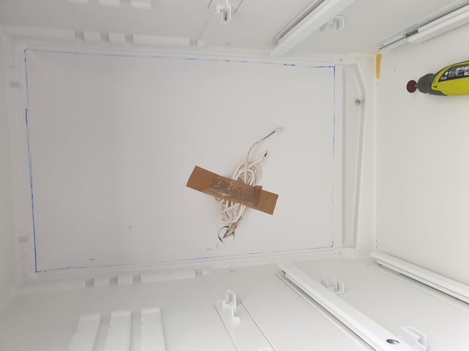
*Fridge compartment with plastic cover removed*

Directly behind this rear plastic wall is the fridge evaporator. The blue outline I've marked is roughly where to cut to avoid damaging this evaporator, but if you just cut close (within an inch) of the sides and upper/lower corners, you should be right.

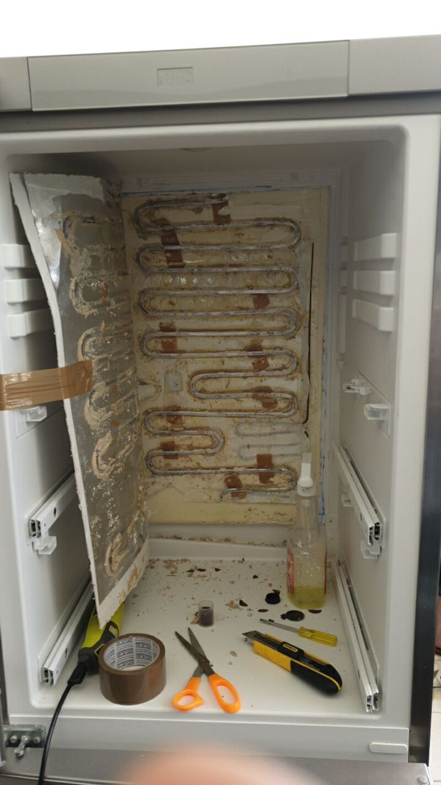
*Fridge compartment with plastic rear wall cut away*

With the cover removed, I used the sniffer again and was getting some beeps, but still no definitive leak. Anywhere I placed the sniffer near the foam would trigger it. I think that over time the refrigerant has "soaked" the foam, which has made it annoyingly hard to find the exact location of the leak.

I couldn't find a leak in the fridge evaporator, so I tried to get at the piping running through the foamed-in the rear wall.

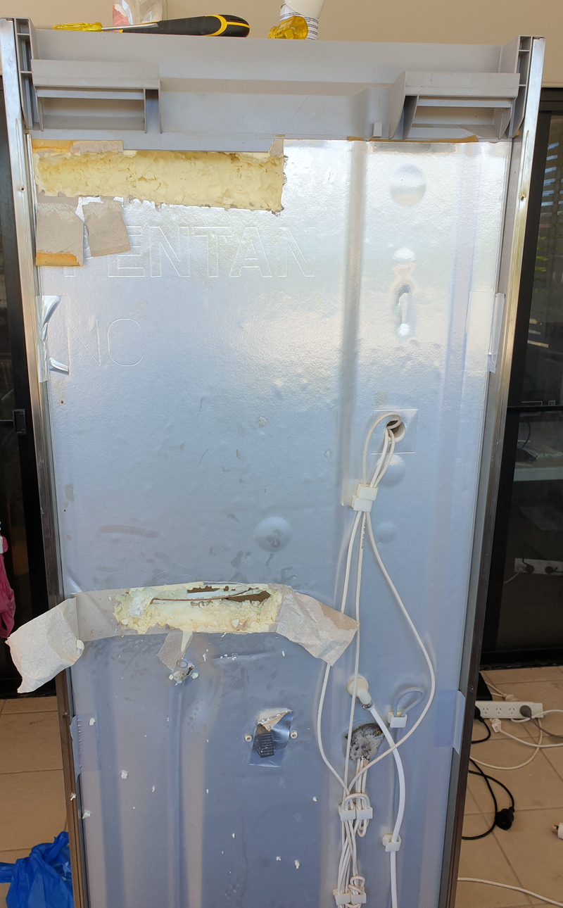
*Rear wall of fridge with foam dug out, exposing the piping*

You can dig out the foam a using a screwdriver, but be careful! You don't want to puncture the piping and cause (another) leak. Go slow doing a little at a time and you should be fine. The dug out section at the top of the picture is where the thin input copper line joins into the evaporator coil. The bottom section is where the input line comes in and the evaporator returns. I couldn't find any leaks here either.

Following the evaporator line to the left and down, you'll eventually get to where the two freezer evaporator pipes are located.

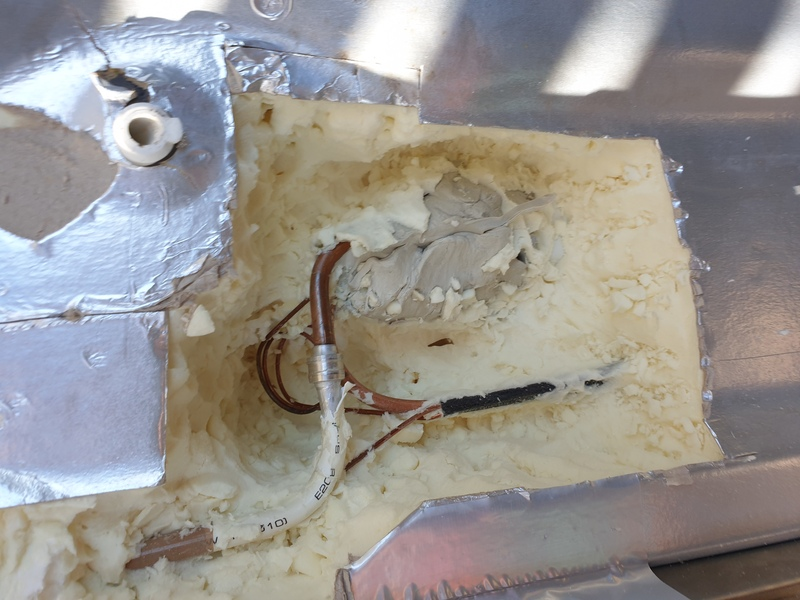
*Rear wall foam dug out, freezer area. The grey goop is where the pipes come down into the freezer compartment*

You can see here the other side where the fridge evaporator coil joins to the copper piping. I checked it for a leak, but again it was fine.

The grey putty-like substance covers the hole where the pipes enter the freezer compartment and connect to the freezer evaporator. I removed the grey goop, and...

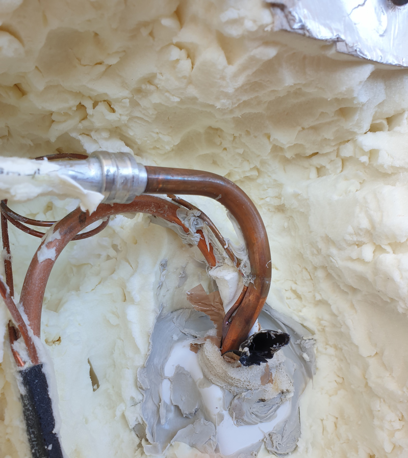

is... is that...

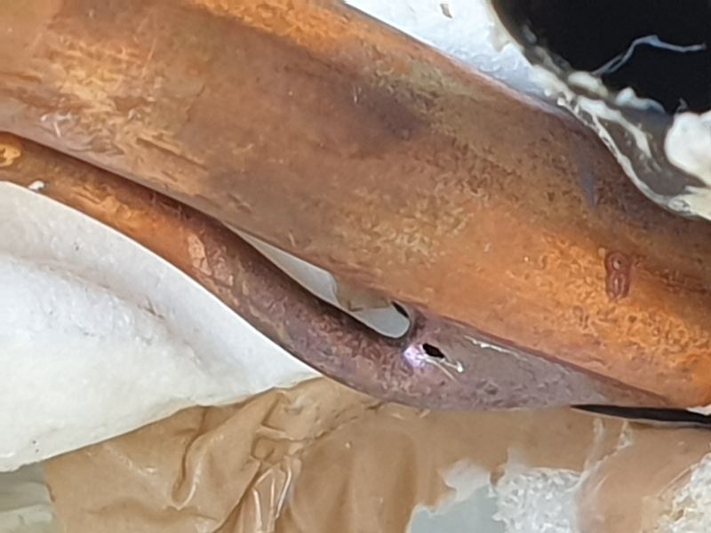

Yes! Finally. In my case, the leak was where the thin copper line carrying liquid refrigerant has been brazed onto the larger copper line connecting to the freezer evaporator.

### Repairing the leak

Professionals will often insist on brazing or soldering over the hole to seal the leak. I tried this and, being an idiot, set my fridge on fire.

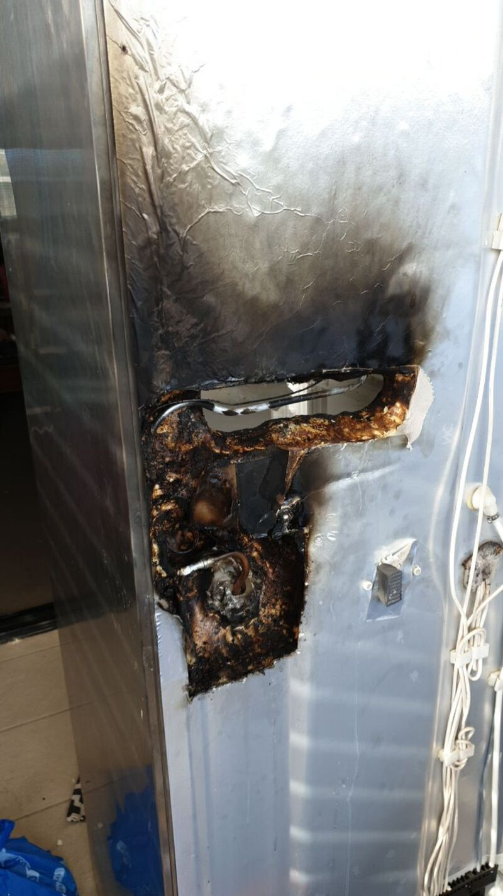
*Behold my shame*

I quickly doused it with water, and it looks worse than it is. Just the surface of the foam burned away. Still, a dumb move on my part and I should have known that foam (soaked in what is basically butane) would be flammable.

Anyway, a much safer and easier way to seal the leak is to use an epoxy glue. Clean the surface well with soapy water and steel wool or fine sand paper first before applying the epoxy.

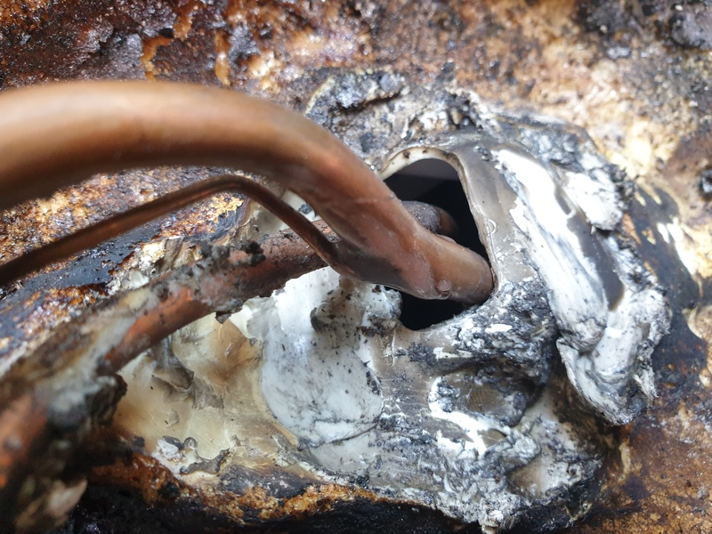
*Leak plugged with epoxy*

With the leak fixed, I used some expanding foam gap-filler from the hardware store and re-foamed the areas I had dug out. After the foam has set, just cut away the foam overflow so it's flush with the wall again (a jigsaw blade works well for this).

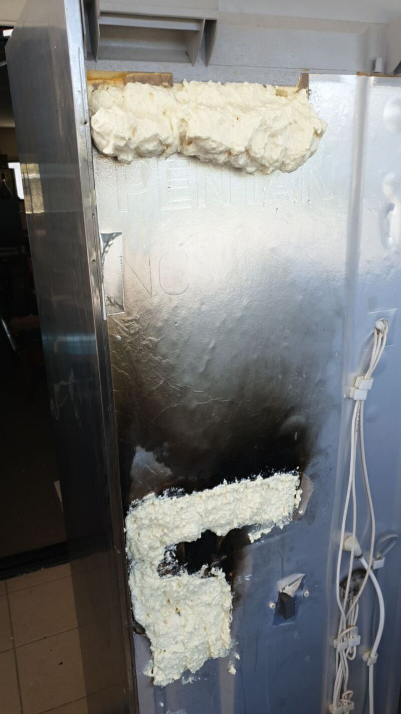

If you cut away the interior plastic wall in the fridge compartment, it can be difficult to place back. I just removed the plastic wall altogether, and just cut out a section around where the temperature sensor is screwed in to keep the evaporator coil in place.

### Recharging the fridge with refrigerant

Now that the leak has been repaired and the fridge put back together, we can refill the fridge with refrigerant.

First, any remaining gas in the fridge lines has to be vacuumed out. Connect the vacuum to the piercing valve port, ensure it is open and turn on the vacuum. Leave it running for about an hour to make sure it has got as much gas as it can. Then close the piercing valve and disconnect the vacuum.

Now connect your can of refrigerant to the piercing valve. Open the piercing valve, but don't open the refrigerant valve just yet. R600a refrigerant is measured by weight, not pressure, and should be stated on a label inside the fridge. In my case, the fridge needs 56g. Place the can of refrigerant on the digital kitchen scales and note the weight. Open the refrigerant valve and slowly let it if flow into the fridge lines, and once the scale reads 56g lighter turn it off. Close the piercing valve, disconnect the refrigerant can and place the cap back on the valve.

## Confirm the repair

Let the fridge run for a few days. If everything went to plan, it should maintain a nice cold temperature and the compressor should eventually stop running constantly.

Enjoy your newly repaired fridge, you definitely earned it.
