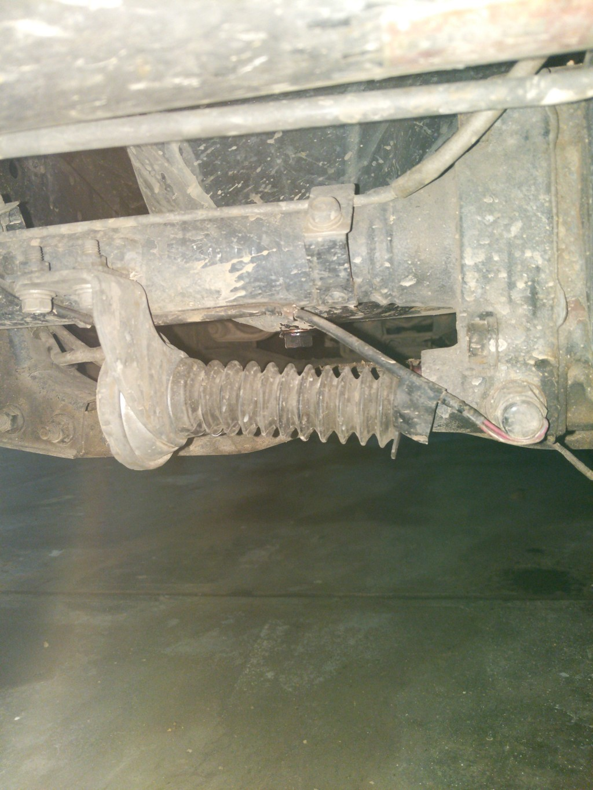
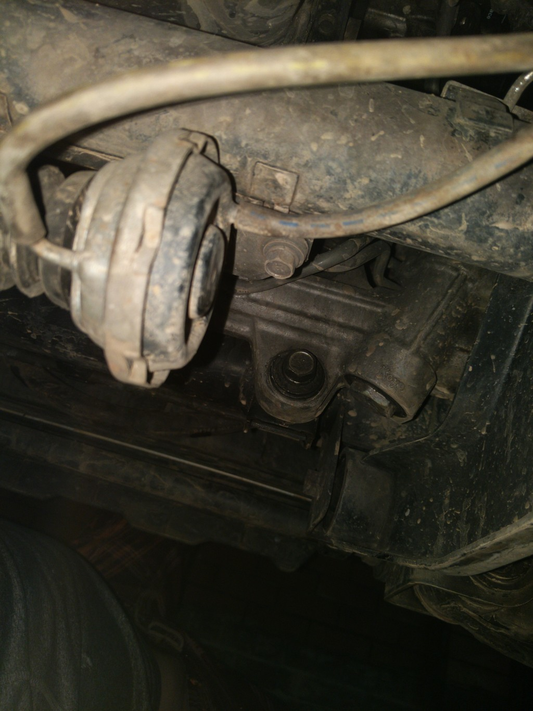
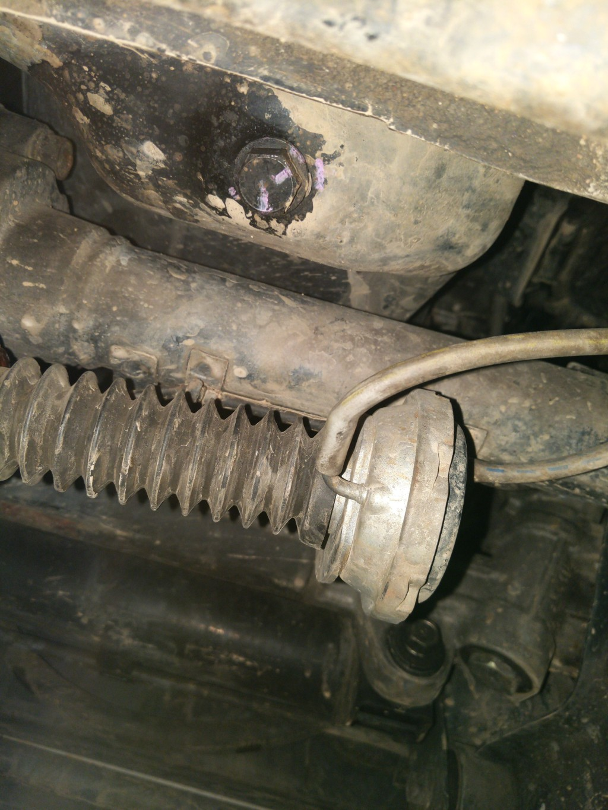
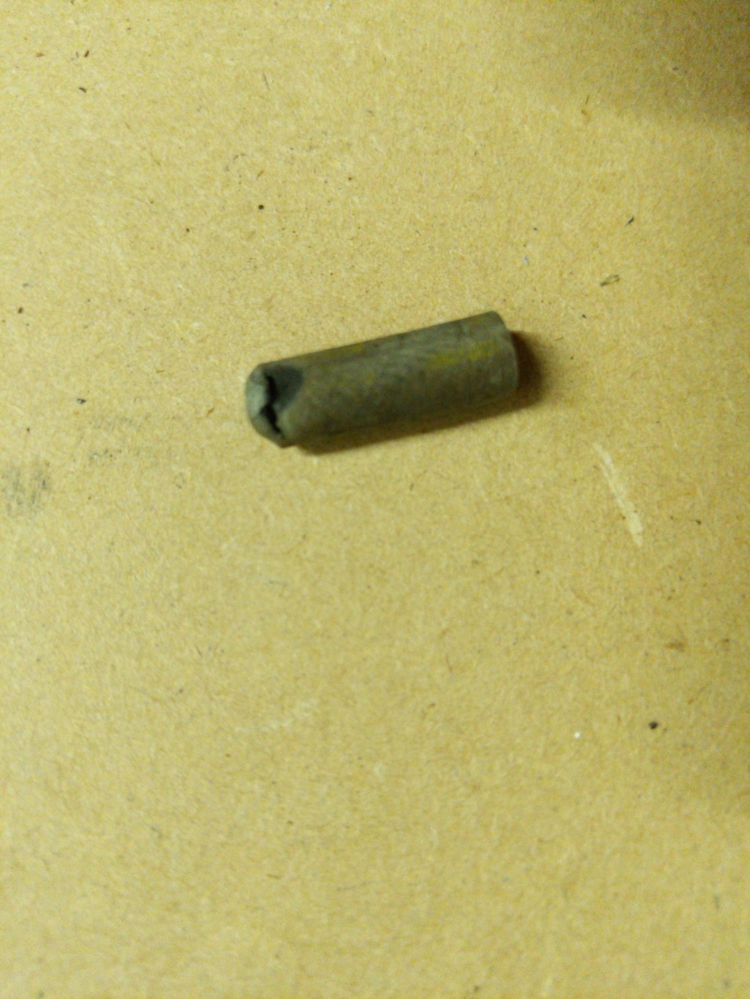

My car has had the "4wd flashing lights" issue for nearly a year. Though in my case it hasn't impacted the operation of the car (switching between 2wd and 4wd still works fine), it is mildly annoying to have my dash blinking at me everytime I drive it.

The 4wd select system is a mix of vacuum tubes, solenoids, actuators and electrical wiring. The cause could be down to any of these systems and [here](http://4wd.blogeasy.com/) is an excellent guide that steps you through each one.

Like many others I thought my issue was due to a failed solenoid so I ordered and installed a new pair of them. But alas, the problem persisted.

I then came across a [forum post](https://www.4x4community.co.za/forum/showthread.php/164762-Triton-4x4-Lights-flashing?p=2100793#post2100793) where the OP had found a hole in the vacuum hose that connects to the front diff actuator. The hoses around the solenoids seemed in good condition but I hadn't checked the actuator.

To access the front diff actuator it is easiest to remove the bash plates first. Once those are off, you should be able to see the actuator clearly.

*Front diff actuator as seen from front of car with bash plates removed*

Looking from the back, you can see the two vacuum hoses that attach to the actuator.

The hose on the left, like that of OP, had worn through near where the end of the metal pipe sits inside of it. It may be that the slight tension on the tube and vibration causes it to wear through on the outer edge.

*Damaged section of vacuum hose, after removal*

You could replace the entire hose or just remove the hose from the actuator, snip off the damaged end and insert it back on. There is enough slack in the tube to do this, but I'm worried it will wear through again. Time will tell.
