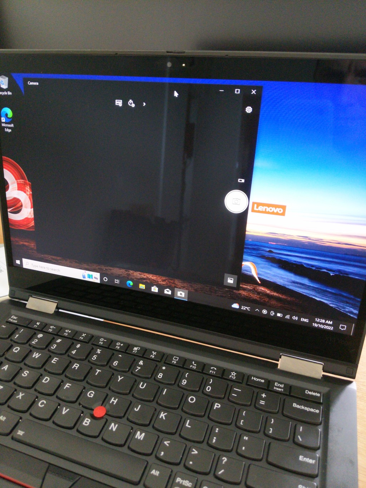
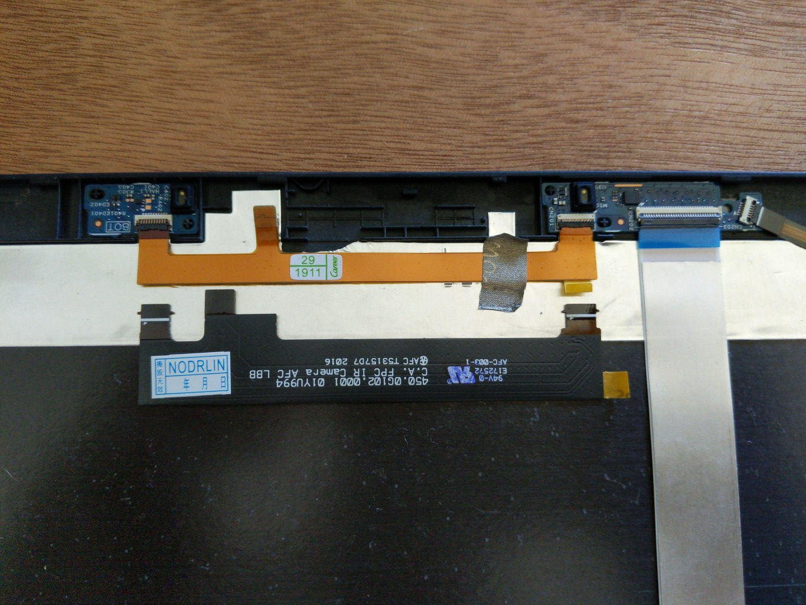
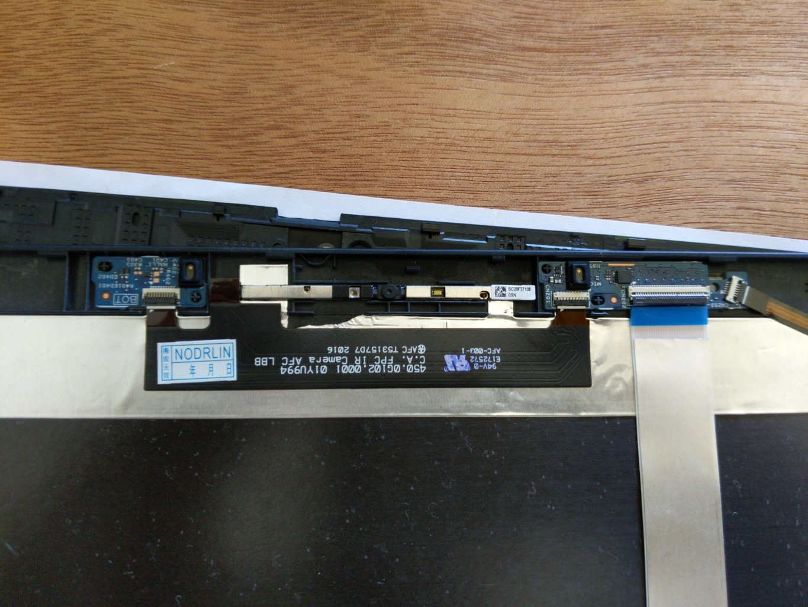
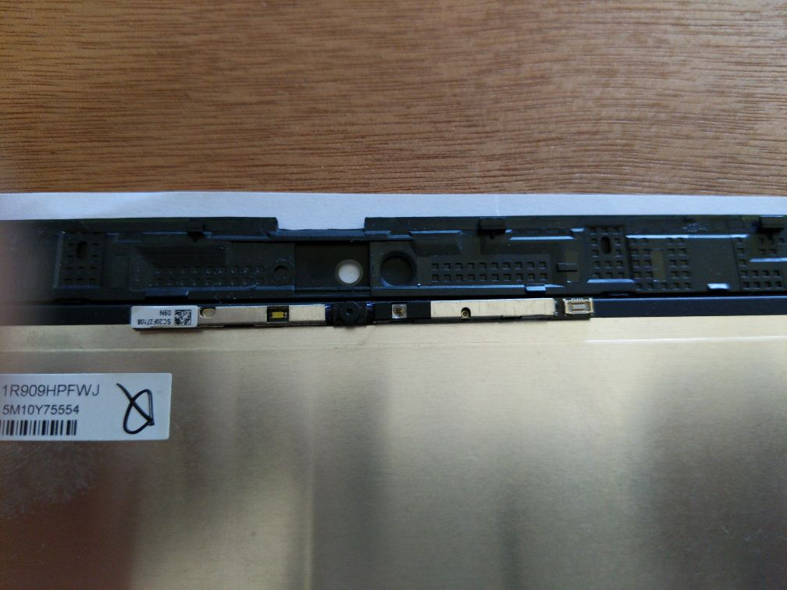
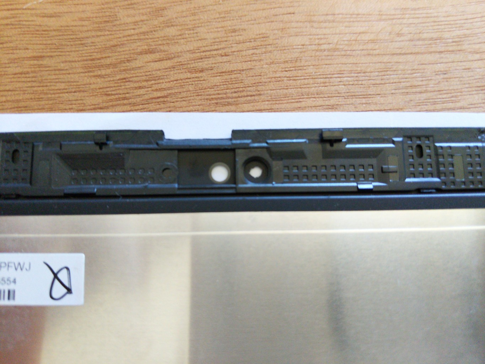
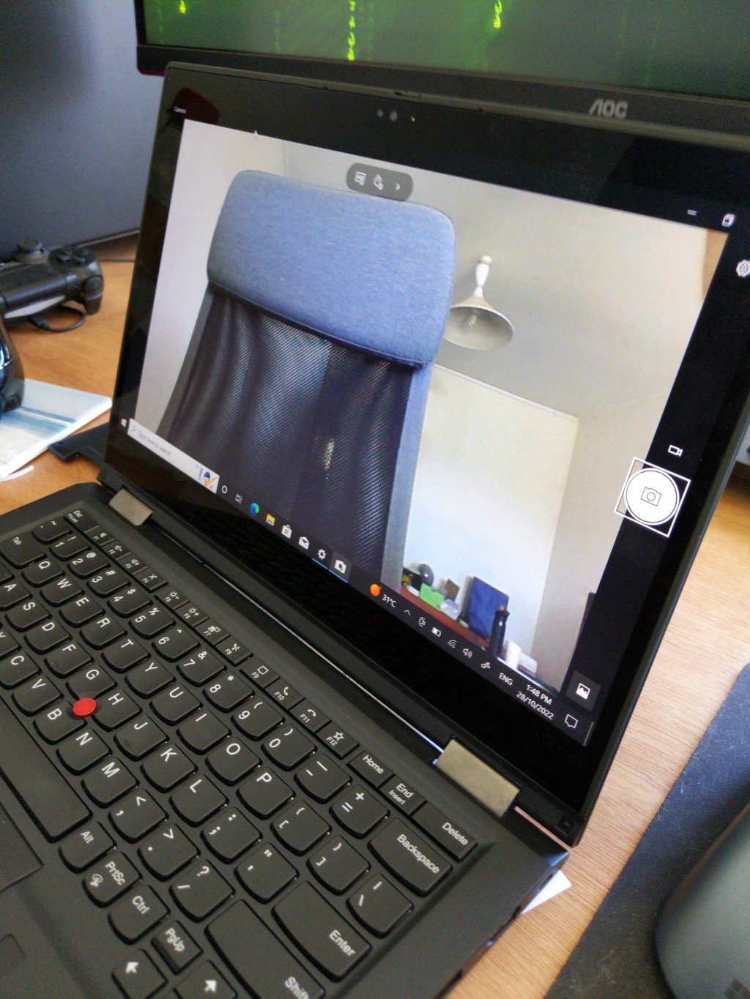
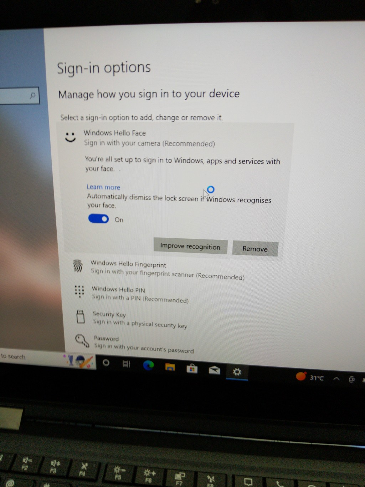

I bought a second-hand Thinkpad X13 Yoga (Gen 1) with a broken camera. A quick search shows this is quite a common problem that usually ends up in a RMA'd laptop, but as this one is well out of warranty I had a go at repairing it.

These laptops come with one of two types of cameras - one that includes an infra-red sensor and one without. The IR sensor is mostly used to sign in using facial recognition (i.e. Windows Hello). My laptop was originally non-IR model but through the repair I upgraded it to an IR-capable camera too.

## The Problem

The issue appears as a black/blank screen when trying to use the camera. I'm not sure if there is a feed from the camera that is just a black image or if there is no feed coming in at all.

*The camera feed only shows a black screen.*

Since the camera is detected by the OS and the LED lights up when trying to be used, I thought the problem is likely to be the camera hardware itself and not a driver problem or issue with the ribbon cables, which appeared fine.

I found a replacement camera module on eBay for about $30 AUD, but mistakenly ordered an IR-capable model. It turns out that this is a pretty easy upgrade though, you just need the corresponding camera ribbon cable too (which accomodates the slightly longer IR camera module). Otherwise the hardware is all the same.

## Disassembling the Laptop

Thinkpad laptops are actually pretty easy to do maintenance on. All the screws are Phillips-head and there are only a couple different sizes. And Lenovo have a pretty thorough [series of videos](https://support.lenovo.com/au/en/solutions/ht510452-removal-and-replacement-videos-thinkpad-x13-yoga-gen-1-20sx-20sy) that will step you through taking apart every part of the laptop. Ultimately we need follow the "Camera / Microphone Card" video to remove and replace the camera module (the start of the video lists which other videos/steps you need to follow first to get here, including removing the back cover, system board and disassembling the LCD panel).

With the camera accessible it's a pretty simple job to remove the old module/ribbon cable and replacing them with the new ones.

*The new cable (black) next to the original (orange).*

*The new cable and module installed.*

## Making a Hole for the IR Sensor

There's a black film on the back of the glass screen around the LCD panel. We need to make a hole in this film for the IR camera to "look" through.

*The white circle is the hole for the camera, and to the right there's a small circle that needs a small hole in it for the IR sensor.*

Very carefully scratch away a small hole in the center of the circle. You want to remove the film without scratching the glass, but the film is quite easy to remove so you won't need much pressure. Some kind of hard plastic utensil (e.g. the corner of a credit card) works well.

*A small hole scratched away for the IR sensor.*

## Reassemble the Laptop

The latter half of each video gives instructions to reassemble the laptop, which is really just reversing the steps you took to disassemble it.

Once the laptop is back together, you should have a working camera and IR sensor.

