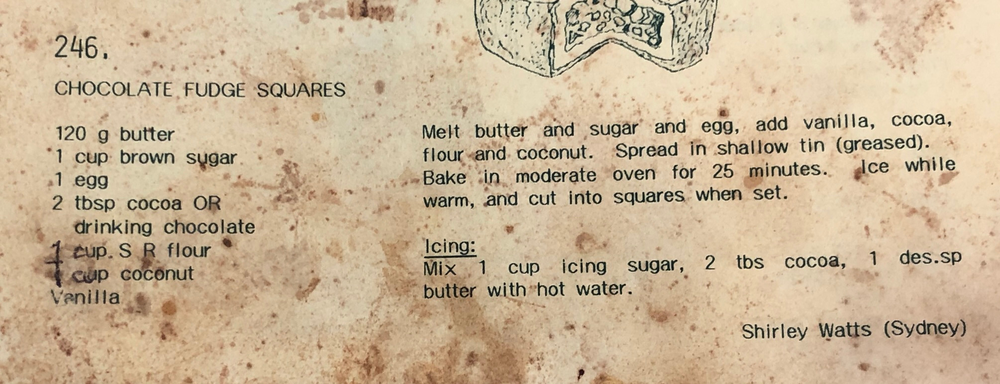

This is an extremely quick and simple dessert that my mum made a lot of growing up and that I often make today. Though the recipe calls it fudge, it's more like what I would call a brownie. A tasty alternative is to swap the coconut for candied or freshly diced cherries.

## Fudge

- 120g butter (melted)
- 1 cup brown sugar
- 1 egg
- 2 tbsp cocoa powder (alt. drinking chocolate)
- 1 cup self-raising flour
- 1 cup coconut
- 1 tsp vanilla essence

In a large bowl, combine the butter, egg and brown sugar. Add the cocoa, flour, coconut and vanilla and mix until well combined. Spread the batter in a shallow, greased tin and bake at moderate heat (~150 deg. celcius) for 25 minutes. Apply icing while still warm and cut into squares when cool.

## Icing

- 1 cup icing sugar
- 2 tbsp cocoa
- 1 tbsp butter (melted)

Mix ingredients together, slowly adding small amounts of hot water until desired consistency.
